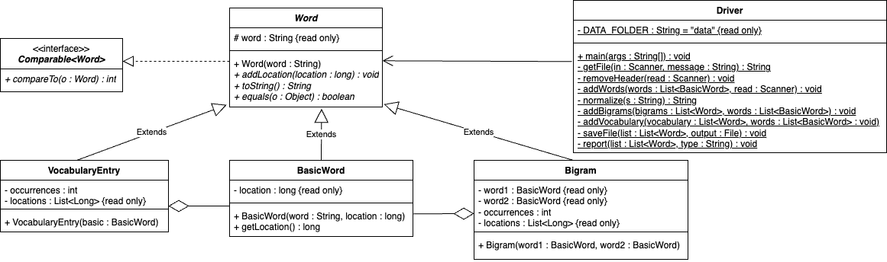

# Lab 13: Text Processing

## Objectives
* Use the ``Scanner`` class to read text files into memory
* Use the ``PrintWriter`` class to write text to test files
* Handling exceptions in an appropriate manner
* Use the `java.util.ArrayList` collection class to hold class data

## Resources
 * Accept the GitHub Classroom assignment invitation in Canvas and then, in IntelliJ, create a new project from Version Control using the repository URL.

## Introduction

In this assigment you will have the computer read in a novel stored as a text file, then
do some frequency analysis on the text and store your results as text files.

## Natural Language Processing

Natural Language Processing (NLP) is one of the most widely used forms of AI by the average person. Web searches, 
auto-correct, auto-complete, spell-check, virtual assistants (Siri, Alexa, etc), machine translation (Google Translate), 
and of course Chat-GPT all rely on various NLP techniques ranging from very simple to very complex. All of these models 
start with a lot of text that is stored in a way that a computer can use. The first steps in building these models are 
reading the text into memory and cleaning it up so that we can perform statistical analysis on the data.

## Normalizing the Data

**Normalizing** data is the act of converting all the data you are working with 
into the same format. Depending on the type of data you have you can do many 
things to normalize to ensure you have homogenous data that can be processed 
in the same way. In the case of text data, we often remove any punctuation, such 
as periods, quotation marks, apostrophes, and so on. We also will often convert 
all of the text to the same case, usually lowercase. This is done because in most 
programming languages, upper and lower case letters are not considered equals as the 
ASCII values that are stored in memry are not the same. 

## Word Position

Often we will want to know where a word is in relation to the other words around it to identify and generate 
phrases and infer meaning. For example, in the following sentences, the word `right` has a different meaning 
depending on the word that surround it:

``Turn right now`` 
``Turn to the right now``

To keep track of the position of a given word, we will keep track of it's location in the source text by simply numbering the words as 
they are read, so the first word in the document will have a position of 0, the next word will have a position of 1, etc. Since our documents will 
be relatively small, this will be sufficient. 

## N-grams

Another common technique used in NLP is grouping words together into larger chunks to process. This is because often in language the same words 
appear next to each other regularly, and by keeping track of these relationships we can gain more information about the language. These chunks are called **N-grams**, where **N** is the number of words in the chunk. The simplest of these is called a **Bigram**. A Bigram is simply two consecutive words whose position is the position of the first word  in the Bigram. For example, the Bigram "i want", the position would be whatever the position of the word "i" is. 

## Frequency Analysis

One of the most important tasks required in NLP is finding the frequency of words and N-grams in a given document. The **Frequency** of a word 
is the number of times the word appears in the document. Additionally, knowing how many different unique words is also useful, 
and so a **Vocabulary**, which contains one of each word that exists in the document, is also tracked separately. This will result in three 
separate collections of data from a single text document:

* A collection of all the words in the order they appear in the document to track the position
* A collection of all the N-grams (Bigrams in our case) that exist in the document
* A collection of all the unique words in the document

## Implementation

For this lab, you will read in a text document using a `java.util.Scanner`, normalize the data that you read in, and generate the three collections listed above for that document. You will then save your bigram and vocabulary lists with their frequencies as separate text files. You will also properly handle any 
exceptions that arise. 

Use the following UML diagram and the associated javadocs for more detailed instructions.

<figure></figure>

## Additional information
* You may assume the files will be stored in a **data** folder in the root of your project.
    * You may not use any hardcoded paths. The only `String`s you may use are the file or folder identifiers.
    * If needed, use [System Properties](https://docs.oracle.com/javase/tutorial/essential/environment/sysprop.html)
* All books from the Project Gutenberg repository contain heaader and footer information that must be removed while processing the file.
    * All headers will end with the same line ``*** START OF THE PROJECT GUTENBERG EBOOK -name of the book- ***``
    * All footers will start with the same line ``*** END OF THE PROJECT GUTENBERG EBOOK -name of the book- ***``
* Every exception you catch should disply a useful message to the user as to what went wrong.
* The String methods [replaceAll()](https://docs.oracle.com/en/java/javase/20/docs/api/java.base/java/lang/String.html#replaceAll(java.lang.String,java.lang.String)) and [startsWith()](https://docs.oracle.com/en/java/javase/20/docs/api/java.base/java/lang/String.html#startsWith(java.lang.String)) could be helpful.
    * The expression ``\\p{Punct}`` will match any punctuation mark.
* Your ``toString()`` methods should be formatted in the following manner:
    * BasicWord: return just the word with no additional whitespace
    * Bigram: The two words should be left justified and always take up 15 spaces. The occurrences should be right justified and always take up 4 spaces
    * VocabularyEntry: The word should be left justified and always take up 15 spaces. The occurrences should be right justified and always take up 4 spaces
* Feel free to add any accessor methods you feel you need, but do not add any mutator methods.
